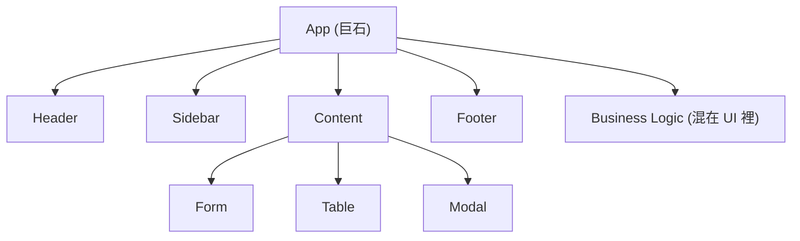
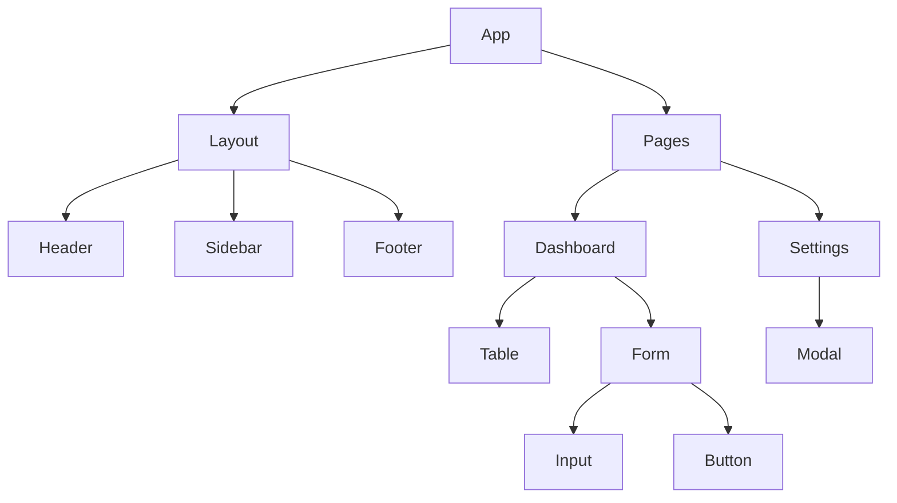

```mermaid
%% bab
flowchart TD
  App["App (巨石)"]
  App --> Header
  App --> Sidebar
  App --> Content
  App --> Footer
  Content --> Form
  Content --> Table
  Content --> Modal
  App --> BusinessLogic["Business Logic (混在 UI 裡)"]
```

```mermaid
%% good
flowchart TD
  App["App"]
  App --> Layout["Layout"]
  Layout --> Header
  Layout --> Sidebar
  Layout --> Footer

  App --> Pages["Pages"]
  Pages --> Dashboard
  Pages --> Settings

  Dashboard --> Table
  Dashboard --> Form
  Form --> Input
  Form --> Button

  Settings --> Modal
```
