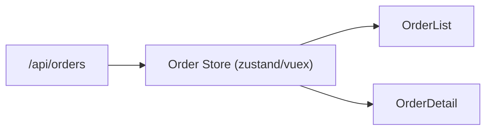
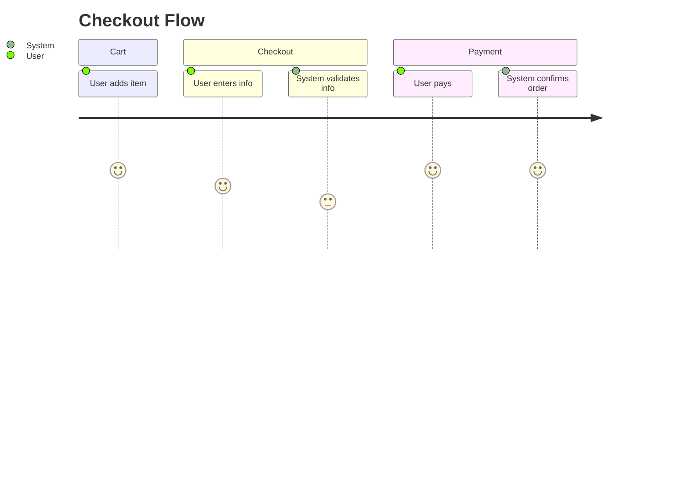
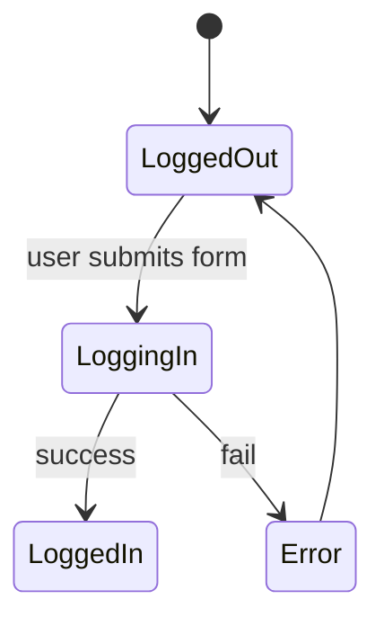

```mermaid
flowchart LR
  API["/api/orders"] --> Store["Order Store (zustand/vuex)"]
  Store --> OrderList
  Store --> OrderDetail
```

```mermaid
journey
  title Checkout Flow
  section Cart
    User adds item: 5: User
  section Checkout
    User enters info: 4: User
    System validates info: 3: System
  section Payment
    User pays: 5: User
    System confirms order: 5: System
```

```mermaid
stateDiagram-v2
  [*] --> LoggedOut
  LoggedOut --> LoggingIn: user submits form
  LoggingIn --> LoggedIn: success
  LoggingIn --> Error: fail
  Error --> LoggedOut
```
